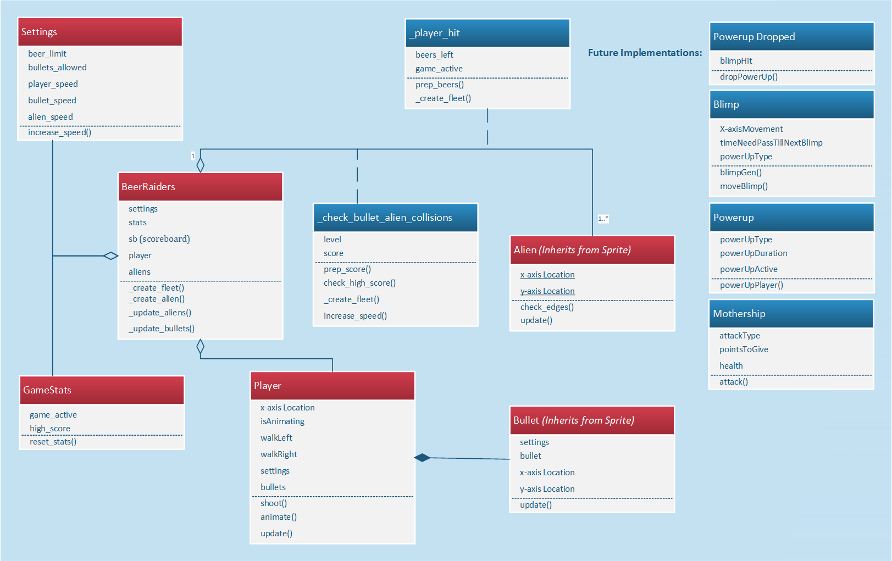

## Initial Requirements

------

##### **Context of Product**

Our team's product will be used in a home or school/workplace environment. The product is a playable game that will be hosted on a Personal Computer. I say that the environment includes the school or workplace because many users will play our game on their laptop. The laptop has the ability to be carried along to different environments. There are many environments that I have not listed that could be listed, but for simplification I have limited the environments to home or workplace. 

##### **Domain Model with Description**

The above UML Class diagram depicts the game system mechanics. The Player has a relationship with Enemies in that the player attacks the enemies. The multiplicity on the enemies end indicates that there will be 1 or more enemies attacking one Player. At all times, there will be only one player attacking one or more enemies. The Scores Points association class indicates that the moment a player attacks and hits an enemy, the moment is recorded as points scored. Each enemy has a specific amount of points to give to a player, once the enemy is destroyed. The points will be added to an aggregate score that the player has within the Score class. An instance of the score class is set as an attribute at the onset of instantiation of the Player class. The Score composition class is indicative of the upkeep of an aggregate score. During the player's game, the score will accumulate to a specific amount and grant the player one extra health. The PointsNeedToExHealth attribute is representative of a constant and the AggregateScore attribute is checked against the PointsNeedToExHealth attribute to find if the player is successful at reaching the required amount of points specified in the PointsNeedToExHealth attribute. 

The Lose Health association class indicates the player is penalized with a loss of health the moment an enemy's attack hits the player. The player has a specific amount of health at the beginning of the game. An aggregate health attribute is used to keep track of the current health assigned to the player. Remember, the player can obtain more health by accumulating points given to a player by the destruction of enemy sprites. A aggregate association of Health to Player class is indicated by the clear diamond at the receiving end of the Player class. This relationship indicates, as does the Score to Player aggregate association, the Player class has an instantiation of the Health class as an attribute. Both the player and Boss have instances of health assigned as an attribute during player class instantiation. Therefore, the Player and Mothership will have to have access to an AggregateHealth attribute and CheckIfHealthRemains() method. 

The PowerUp Dropped association class is dependent on the attacks issued by the Player to a blimp. This relationship indicates that there will be an item dropped the moment the blimp is hit by a player attack. The next appearance of a blimp is reliant on the time the previous blimp appeared in the game. The PowerUp to Player aggregate association indicates that the player will become attributed with powerups throughout his or her gameplay. In fact the instantiation of the PowerUp class begins the moment there is an instance of the Player object class. The powerup will have a 1 to 1 relationship with the Player.  This means the player will be granted one powerup ability at a time. Each powerup remains in use for a specific amount of time or until the player collects a different powerup. The invincibility powerup will always last for a specified amount of time. Whereas, the rapid fire powerup will last until the player is hit with an enemy attack. The Blimp class will generate the Blimps carrying the powerups onto the screen at specific time intervals to allow for the player to obtain different powerups.    

The Mothership and UFO enemy types are both subclasses that inherit class members and methods from the Enemies superclass. This is indicated by the sub-type relation contained between them and the Enemies class. Moreover, Score and PowerUp classes can be implemented as sub-classes of Player, but the preferred implementation is to have it be an aggregate of the Player class. 

##### **User Characteristics and Expectations**

The skills of the user of the game vary from semi-skilled game enthusiasts to new and un-skilled gamers. The game's controls are easy to understand, and the game's user interface does not have components that need explaining. The components are self explanatory because there are labels for score and Health. Powerups that are obtained by the player would be described at the beginning of the game through the use of an instruction screen. Instructions displayed will be player movement controls and descriptions of each powerup and their effects on the user.

I understand that the user will want some functionality in terms of different levels and increasing difficulty as levels progress. This expectation was addressed in the user stories document. It is of importance to ensure a player is presented with a steady playthrough without having too great of a challenge as well. That is why having an increase of powerups appear during the higher difficulty levels is important. The process of finding out the playability of the game will be further inspected by conducting interviews with the players who play the game.  
